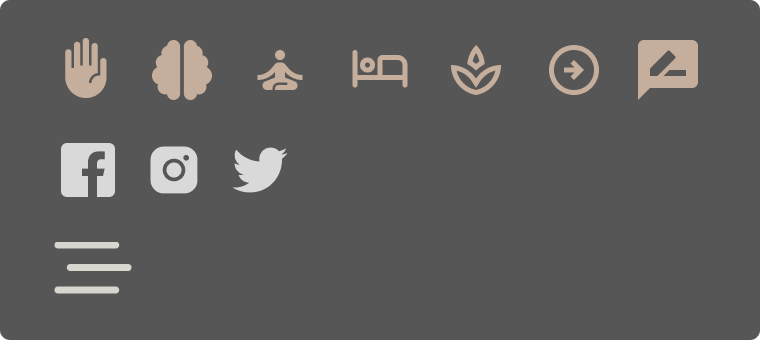
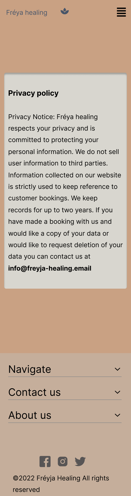

  

# Fréyja healing

The path to optimal health is closer than ever. At Fréyja healing, we believe in the bodies natural healing ability's.  However,
if you a suffering with a lingering ache or chronically stressed, book an appointment with any of our experienced naturopaths & begin your journey to better health.

---

## **UX** 🎨

### User stories

As a user, customer I would like to the following:

✅ successfully implemented  
❌ not yet implemented

- ✅ View information (prices and details) on all available services.
- ✅ View opening times & contact information.
- ✅ View information on naturopaths (practitioners).
- ✅ View privacy policy on how the users information is handled.
- ✅ Send inquires about a service.
- ✅ Book an appointment.
- ❌ Add uniques image for each available service.
- ❌ Improve SEO (Add open graph meta information).
- ❌ Receive email appointment confirmation.
- ❌ Receive email contact form confirmation.
- ❌ Setup payment processing.
- ❌ Add account page for users:
  - User can view account information
  - User can place booking via payment method
  - User can write review
- ❌ Improve security:
  - Add Cloudflare Turnstile (privacy focused captcha).
  - Protect mailto address (further research needed).
  - Add Content Security Policy (further research needed).
- ❌ Add unit testing & CI workflow (further research needed)

### Design

Color pallet

#### Icons

- I utilized the [nuxt icon](https://github.com/nuxt-modules/icon) module to generate the icons. The Icons are from Google Fonts Material Symbols

#### Typography

- I chose to use default browser fonts & not to use a custom font.

#### Wireframes

Mobile

Booking (step 1)

Booking page (step 2)

Booking page (confirmation)

Home page

Contact page

Contact page write to us

Privacy page

Team page

Treatment page

---

Desktop

Booking page (step 1)

Booking page (step 2)

Booking page (confirmation)

Home page

Contact page

Contact page write to us

Privacy page

Team page

Treatment page

---

## **Features** ✨

### 1. Book appointment

- Users can choose from any of our 6 appointments & place a booking. The user is required to enter the following:
  - Name
  - Email
  - Contact number
  - Choose a time & date
  - Submit after verifying their details are correct

### 2. View all services

- View all services with an overview of the following INFORMATION
  - Treatment Details
    - Treatment
    - Treatment duration
    - Treatment Price
  - A list of benefits of the treatment
  - Treatment brief description

### 3. Send inquiry

- Users can send inquiry about any of the services offered with the following INFORMATION
  - Name
  - Email
  - service
  - Short message

### 4. Navigation flyout menu

- Users can easily navigate to any of the available services.
- Users can easily navigate to the contact page.
- Users can easily navigate to the about us page.

---

## **Future features** 🔮 (2023)

- ❌ Add uniques image for each available service.
- ❌ Improve SEO (Add open graph meta information).
- ❌ Receive email appointment confirmation.
- ❌ Receive email contact form confirmation.
- ❌ Setup payment processing.
- ❌ Add account page for users:
  - User can view account information
  - User can place booking via payment method
  - User can write review
- ❌ Improve security:
  - Add Cloudflare Turnstile (privacy focused captcha).
  - Protect mailto address (further research needed).
  - Add Content Security Policy (further research needed).
- ❌ Add unit testing & CI workflow (further research needed)

 

[🔝 Back to Top](#fréyja-healing)

---

## **Technologies** ⚙️

### Web development

- 

  - [Code editor & IntelliSense for VusJs & Tailwind CSS ](https://code.visualstudio.com) 🔗

- 
  - [Used as version control system](https://git-scm.com) 🔗

### Design

- 
  - [Used for designing wireframes](https://www.figma.com) 🔗

 

### Front-End Technologies

- 

  - Markup language used within VueJS templates.

- 
  - Used to style elements within pages & add transition effects.
- 
  - Used to add reactivity.
  - From validation (client side)
  - Return data based on query parameters

#### Ui Library / CSS framework

- 
  - [Tailwindcss](https://tailwindcss.com/docs/cursor) 🔗 (Used to enhance workflow & improve maintainability of CSS).

 

#### JavaScript Library

- 
  - [Vue.js](https://vuejs.org) 🔗 (The Progressive JavaScript Framework)
  - Reactivity.
  - Reusable components.

 

### JavaScript Framework

- [NuxtJS](https://nuxtjs.org/deployments/github-pages) 🔗 (The Intuitive Vue Framework)
  - Used for server side rendering.
  - Enhanced SEO.
  - Image optimization.
  - Code optimization (minified CSS & JavaScript).
  - State management.

### Additional modules to extend NuxtJs 🔌

1. [NuxtJS Modules](https://modules.nuxtjs.org/) 🔗 (Extends NuxtJS functionality)
   - [Nuxt Icon](https://github.com/nuxt-modules/icon) 🔗 Used to generate Icons for project.
   - [Nuxt image](https://image.nuxtjs.org/) 🔗 Used to optimize images for variable screen sizes & convert to [webp](https://developers.google.com/speed/webp) image format.

 

2. [VueJS devtools](https://chrome.google.com/webstore/detail/vuejs-devtools/nhdogjmejiglipccpnnnanhbledajbpd?hl=en) 🔗 Used to inspect debug VueJS (performance issues & reactivity issues)

 

[🔝 Back to Top](#fréyja-healing)

---
