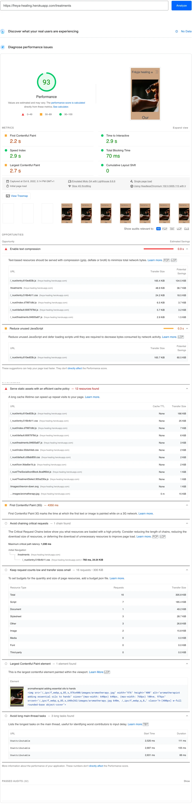

  

# Fréyja healing

The path to optimal health is closer than ever. At Fréyja healing, we believe in the bodies natural healing ability's.<br> However,
if you a suffering with a lingering ache or chronically stressed, book an appointment with any of our experienced naturopaths & begin your journey to better health.

---

## **UX** 🎨

### User stories

As a user, customer I would like to the following:

✅ successfully implemented <br>
❌ not yet implemented

- ✅ View information (prices and details) on all available services.
- ✅ View opening times & contact information.
- ✅ View information on naturopaths (practitioners).
- ✅ View privacy policy on how the users information is handled.
- ✅ Send inquires about a service.
- ✅ Book an appointment.
- ❌ Add uniques image for each available service.
- ❌ Improve SEO (Add open graph meta information).
- ❌ Receive email appointment confirmation.
- ❌ Receive email contact form confirmation.
- ❌ Setup payment processing.
- ❌ Add account page for users:
  - User can view account information
  - User can place booking via payment method
  - User can write review
- ❌ Improve security:
  - Add Cloudflare Turnstile (privacy focused captcha).
  - Protect mailto address (further research needed).
  - Add Content Security Policy (further research needed).
- ❌ Add unit testing & CI workflow (further research needed)

### Design

<details>
<summary>Color pallet</summary>


</details>

#### Icons

- I utilized the [nuxt icon](https://github.com/nuxt-modules/icon) module to generate the icons. The Icons are from Google Fonts Material Symbols


#### Typography

- I chose to use default browser fonts & not to use a custom font.

#### Wireframes

Mobile

<details>
<summary>Booking (step 1)</summary>


</details>

<details>
<summary>Booking page (step 2)</summary>


</details>

<details>
<summary>Booking page (confirmation)</summary>


</details>

<details>
<summary>Home page</summary>


</details>

<details>
<summary>Contact page</summary>


</details>

<details>
<summary>Contact page write to us</summary>


</details>

<details>
<summary>Privacy page</summary>


</details>

<details>
<summary>Team page</summary>


</details>

<details>
<summary>Treatment page</summary>


</details>

---

Desktop

<details>
<summary>Booking page (step 1)</summary>


</details>
<details>

<summary>Booking page (step 2)</summary>


</details>

<details>
<summary>Booking page (confirmation)</summary>


</details>

<details>
<summary>Home page</summary>


</details>

<details>
<summary>Contact page</summary>


</details>

<details>
<summary>Contact page write to us</summary>


</details>

<details>
<summary>Privacy page</summary>


</details>

<details>
<summary>Team page</summary>


</details>

<details>
<summary>Treatment page</summary>


</details>

---

## **Features** ✨

### 1. Book appointment

- Users can choose from any of our 6 appointments & place a booking. The user is required to enter the following:
  - Name
  - Email
  - Contact number
  - Choose a time & date
  - Submit after verifying their details are correct

### 2. View all services

- View all services with an overview of the following INFORMATION
  - Treatment Details
    - Treatment
    - Treatment duration
    - Treatment Price
  - A list of benefits of the treatment
  - Treatment brief description

### 3. Send inquiry

- Users can send inquiry about any of the services offered with the following INFORMATION
  - Name
  - Email
  - service
  - Short message

### 4. Navigation flyout menu

- Users can easily navigate to any of the available services.
- Users can easily navigate to the contact page.
- Users can easily navigate to the about us page.

---

## **Future features** 🔮 (2023)

- ❌ Add uniques image for each available service.
- ❌ Improve SEO (Add open graph meta information).
- ❌ Receive email appointment confirmation.
- ❌ Receive email contact form confirmation.
- ❌ Setup payment processing.
- ❌ Add account page for users:
  - User can view account information
  - User can place booking via payment method
  - User can write review
- ❌ Improve security:
  - Add Cloudflare Turnstile (privacy focused captcha).
  - Protect mailto address (further research needed).
  - Add Content Security Policy (further research needed).
- ❌ Add unit testing & CI workflow (further research needed)

<br>

[🔝 Back to Top](#fréyja-healing)

---

## **Technologies** ⚙️

### Web development

- 

  - [Code editor & IntelliSense for VusJs & Tailwind CSS ](https://code.visualstudio.com) 🔗

- 
  - [Used as version control system](https://git-scm.com) 🔗

### Design

- 
  - [Used for designing wireframes](https://www.figma.com) 🔗

<br>

### Front-End Technologies

- 

  - Markup language used within VueJS templates.

- 
  - Used to style elements within pages & add transition effects.
- 
  - Used to add reactivity.
  - From validation (client side)
  - Return data based on query parameters

#### Ui Library / CSS framework

- 
  - [Tailwindcss](https://tailwindcss.com/docs/cursor) 🔗 (Used to enhance workflow & improve maintainability of CSS).

<br>

#### JavaScript Library

- 
  - [Vue.js](https://vuejs.org) 🔗 (The Progressive JavaScript Framework)
  - Reactivity.
  - Reusable components.

<br>

### JavaScript Framework

- [NuxtJS](https://nuxtjs.org/deployments/github-pages) 🔗 (The Intuitive Vue Framework)
  - Used for server side rendering.
  - Enhanced SEO.
  - Image optimization.
  - Code optimization (minified CSS & JavaScript).
  - State management.

### Additional modules to extend NuxtJs 🔌

1. [NuxtJS Modules](https://modules.nuxtjs.org/) 🔗 (Extends NuxtJS functionality)
   - [Nuxt Icon](https://github.com/nuxt-modules/icon) 🔗 Used to generate Icons for project.
   - [Nuxt image](https://image.nuxtjs.org/) 🔗 Used to optimize images for variable screen sizes & convert to [webp](https://developers.google.com/speed/webp) image format.

<br>

2. [VueJS devtools](https://chrome.google.com/webstore/detail/vuejs-devtools/nhdogjmejiglipccpnnnanhbledajbpd?hl=en) 🔗 Used to inspect debug VueJS (performance issues & reactivity issues)

<br>

[🔝 Back to Top](#fréyja-healing)

---

## Testing 🧪

### 1. Page speed metrics & SEO analytics

[Google page speed insight](https://pagespeed.web.dev) (Used for testing performance & SEO) 🔗

Mobile

<details>
<summary>About us</summary>


</details>

<details>
<summary>Booking</summary>


</details>

<details>
<summary>Contact</summary>


</details>

<details>
<summary>Home</summary>


</details>

<details>
<summary>Privacy</summary>


</details>

<details>
<summary>The team</summary>


</details>

<details>
<summary>Treatments</summary>



</details>

---

Desktop

<details>
<summary>About us</summary>


</details>

<details>
<summary>Booking</summary>


</details>

<details>
<summary>Contact</summary>


</details>

<details>
<summary>Home</summary>


</details>

<details>
<summary>Privacy</summary>


</details>

<details>
<summary>The team</summary>


</details>

<details>
<summary>Treatments</summary>


</details>
<br>

### 2. Browser Testing

>  **NOTE** <br>
> I tested responses in Firefox Developer & Google Chrome from 300px to 1200px & Iphone for mobile device testing.

#### Firefox Developer Edition (v.108.0.5343.2)

>  **NOTE** <br>
> knowledge of accessibility is limited, application will need audit at later date to improve accessibility for screen readers.

- Check for overflow issues.
  1. Home page information cards overflow at 300px
- Check for accessibility issues (contrasting colors).
  1. None found

---

#### Google Chrome Dev (v.108.0.5343.2)

>  **NOTE** <br>
> knowledge of unit testing is limited, application will need unit testing at later date.

>  **INFORMATION** <br>
> NuxtJS & [Vite](https://vitejs.dev/) provide excellent development experience & detailed errors in development.

- Check for JavaScript errors
  1. All known errors resolved in development.

---

#### Safari iOS (v16.0.2)

>  **BUG CSS** <br>
> is() CSS pseudo-class does not work on invalid form input.

- View mobile experience (validate page links work & inputs on forms)

<br>

### 3. Form validation (Manual input to check validity of forms)

>  **NOTE** <br>
> Input validation is based on pattern attribute value

1. Contact us page: The form will not send unless the following rules are met.

- First & last name: (Required) must have 2 - 20 characters using alphabetic notation only.
- Email: (Required) must be a valid email address & math pattern.
- Service option: (Not required) Choose a service are predefined options.
- User message: (Required) must be 5 - 300 characters.

2. Booking page: The form will not send unless the following rules are met.

- Name: (Required) must have 2 - 20 characters using alphabetic notation only.
- Email: (Required) must be a valid email address & math pattern.
- Phone number: (Required) must be numeric only and 5 - 10 characters.
- Calender: (Required) Choose date, calender is not viewable beyond December 2022 & before the current month of the current year.
- Time: (Required) Time must be between 9AM - 5PM, 9AM is predefined input if no time is chosen.
- Booking confirmation details: Check users details are correct.
  - Name
  - Email
  - Phone number
  - Appointment date
  - Appointment time

<br>

### External Validation Testing HTML | CSS | JavaScript

>  **Important** <br>
> HTML & CSS validation returns 54 CSS parsing errors. This issue is discussed by the maintainer of Tailwindcss & has provided a solution however,
> <br>
> I cannot use the recommended fix as I use scoped styles within VueJS. This will break styles used within the application.
> [Remove --tw- variables from universal selector #7317](https://github.com/tailwindlabs/tailwindcss/discussions/7317) 🔗

#### 1. HTML

[W3C Markup Validation](https://validator.w3.org/) 🔗 (Validate HTML)

<details>
<summary>About us page</summary>


</details>

<details>
<summary>Booking page</summary>


</details>

<details>
<summary>Contact page</summary>


</details>

<details>
<summary>Home page</summary>


</details>

<details>
<summary>The team page</summary>


</details>

<details>
<summary>Treatments page</summary>


</details>

<br>

#### 2. CSS

[W3C CSS Validation](https://jigsaw.w3.org/css-validator/#validate_by_upload) 🔗 (Validate CSS)

<details>
<summary>About us page</summary>


</details>

<details>
<summary>Booking page</summary>


</details>

<details>
<summary>Contact page</summary>


</details>

<details>
<summary>Home page</summary>


</details>

<details>
<summary>The team page</summary>


</details>

<details>
<summary>Treatments page</summary>


</details>

<br>

#### 3. JavaScript

[JS Hint](https://jshint.com) 🔗 (Validate JavaScript)

I added the following rule to ignore missing semicolons and test for ECMAScript 9 support.

```javascript
/* jslint asi: true, esversion: 9 */
```

Not all VueJS files contain JavaScript that can be tested with JS Hint. I tested the following files.

- Pages

  - contact.vue
  - booking.vue
  - treatments.vue

- Components

  - AppFormInput.vue
  - ContactForm.vue
  - TheFooter.vue

- Composables
  - Services.js

<details>
<summary>Js Hint results</summary>


</details>

### Development Automated Testing | Linting

>  **Important** <br>
> NuxtJS auto imports VusJS components, Eslint will display no-undefined warnings, I have yet to find a fix for this.<br>[Nuxt Auto imports](https://v3.nuxtjs.org/guide/concepts/auto-imports) 🔗

VueJS & JavaScript

I added Eslint & Eslint-plugin-vue to validate & check for errors during development as well as follow VueJS best practices based on
[VusJs style guide](https://vuejs.org/style-guide/rules-essential.html). Linting errors are shown in visual studio code terminal.

1. [Eslint Plugin Vue](https://eslint.vuejs.org/)

<br>

[🔝 Back to Top](#fréyja-healing)

---
